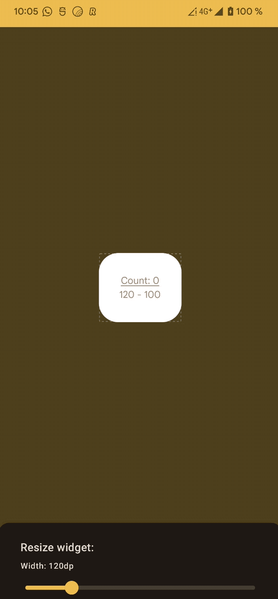

# Previews for Glance-appwidget

[](https://search.maven.org/search?q=g:com.google.android.glance.tools)

Previews for Glance-appwidget allows developers to speed up UI iterations and UI testing by
providing
an embedded activity that displays all apps widgets, embedded inside the app (instead of the
launcher),
offering faster previews and benefiting from the “Apply Changes” and “Live Edits” from Android
Studio, among other features.

## Details

The preview does not rely on
the [AppWidgetManager](https://developer.android.com/reference/android/appwidget/AppWidgetManager)
and skips the BroadcastReceiver mechanism to directly render the
[RemoteViews](https://developer.android.com/reference/android/widget/RemoteViews)
inside the app’s activity by using the AppWidgetHostView directly ([limitations](#Limitations)).

This together with Compose
and [Live Edits](https://developer.android.com/jetpack/compose/tooling#live-edit)
we can achieve ([in most situations](https://developer.android.com/studio/run#limitations)) a
hot-reload mechanism,
allowing developers to see the changes reflected nearly instantaneously.


By embedding the app widget inside the app, we automatically enable available developer tools like
[Layout Inspector](https://developer.android.com/jetpack/compose/tooling#layout-inspector).


### Setup

The library is integrated in 3 simple steps:

*First*, add it as debug dependency:

```groovy
repositories {
    mavenCentral()
}

dependencies {
    debugImplementation "com.google.android.glance.tools:appwidget-preview:<version>"
}
```

*Second*, create a debug activity inside the debug folder and register it in
the `AndroidManifest.xml`:

```xml

<activity android:name=".MyWidgetPreviewActivity" android:exported="true">
    <intent-filter>
        <action android:name="android.intent.action.MAIN" />
        <category android:name="android.intent.category.LAUNCHER" />
    </intent-filter>
</activity>
```

> Note: setting the LAUNCHER intent-filter is optional but it will add a direct access in the device

*Third*, provide the preview information:

```kotlin
class MyWidgetPreviewActivity : GlancePreviewActivity() {

    override suspend fun getGlancePreview(
        receiver: Class<out GlanceAppWidgetReceiver>
    ): GlanceAppWidget {
        return when (receiver) {
            MyGlanceWidgetReceiver::class.java -> MyGlanceWidget()
            else -> throw IllegalArgumentException()
        }
    }

    override suspend fun getGlanceState(instance: GlanceAppWidget): Any {
        return when (instance) {
            is MyGlanceWidget -> mutablePreferencesOf(intPreferencesKey("state") to value)
            else -> throw IllegalArgumentException()
        }
    }

    override fun getProviders() = listOf(MyGlanceWidgetReceiver::class.java)
}
```

Now, you can launch the activity from Android Studio (change the run configuration) and preview the
changes.

### Additional features.

#### Displays a list of provided apps widgets

`GlancePreviewActivity` offers an API to pass a `GlanceAppWidget` instance (or RemoteView directly)
enabling customization of the widget and allowing initialization of data/stuff before displaying
widget (e.g setting a fake GlanceState)


#### Resizing the widget and respecting SizeMode.

Use the resize panel to adjust sizing attributes and ensure the UI fits in all modes/sizes.
The example below shows a widget that displays the size value for each of the Glance SizeModes

<table>
  <tr>
    <td align="center">Single</td>
    <td align="center">Exact</td>
    <td align="center">Responsive</td>
  </tr>
  <tr>
    <td></td>
    <td></td>
    <td></td>
  </tr>
</table>

#### Highlight missing meta-data

Use the info panel to display the AppWidgetProviderInfo metadata and highlight missing information


#### Extract Preview and share:

Use the share button to export the current preview into a PNG image. This image will be stored
inside
the device gallery under "appwidget-previews". These preview images can be used
as `android:previewImage`
metadata for the appwidget.

To retrieve the files:

1. `adb pull sdcard/Pictures/appwidget-previews .`
2. Use the [Device File Explorer](https://developer.android.com/studio/debug/device-file-explorer)
   in Android Studio


### Limitations

The design works with the following limitations:

* Actions callback, updates or updating the state do not work since the widget is not “hosted”.
* The exact representation in the launcher might differ depending on the launcher implementation.
* All “Live Edits” and “Apply Changes” limitations apply
    * e.g Android Studio electric Eel + Android 10+ is needed.
* Some projects might not work with Apply changes or Live Edits.

# Snapshots

Snapshots of the development version are available in [Sonatype's `snapshots` repository][snap].
These are updated on every commit.

[snap]: https://oss.sonatype.org/content/repositories/snapshots/com/google/android/glance/tools/appwidget-preview/